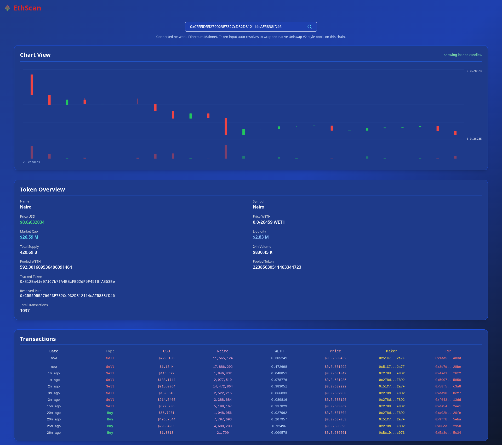

## Crypto Defi Screener
Get realtime transactions of erc 20 token from mainnet rpc and token metadata and market data.

### Features
- Get Realtime transactions on erc token address.
- Get Accurate token Metadata like price , pooled tokens and number of transactions.
- Get Realtime Chart view for tokens for one second ticker in candlestick view.

## Env
- HTTP_URL for https ethereum rpc node
- WS_URL for websocket connection to ethereum rpc node

## Run
docker compose up --build -d

Or use `./start.sh` to remove the app container/image first, rebuild, stream logs, and clean everything back up when you stop it with `Ctrl+C`.

## Image

